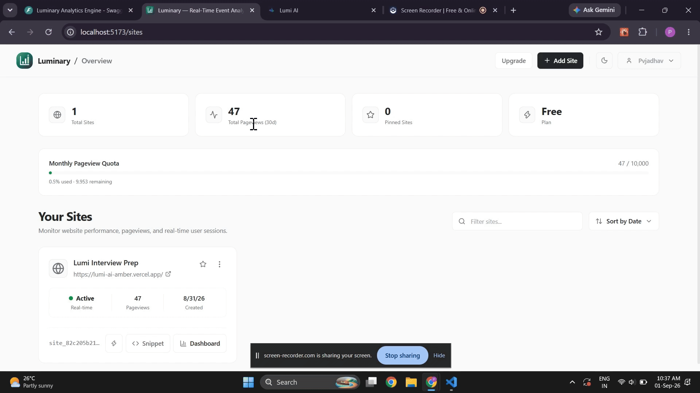
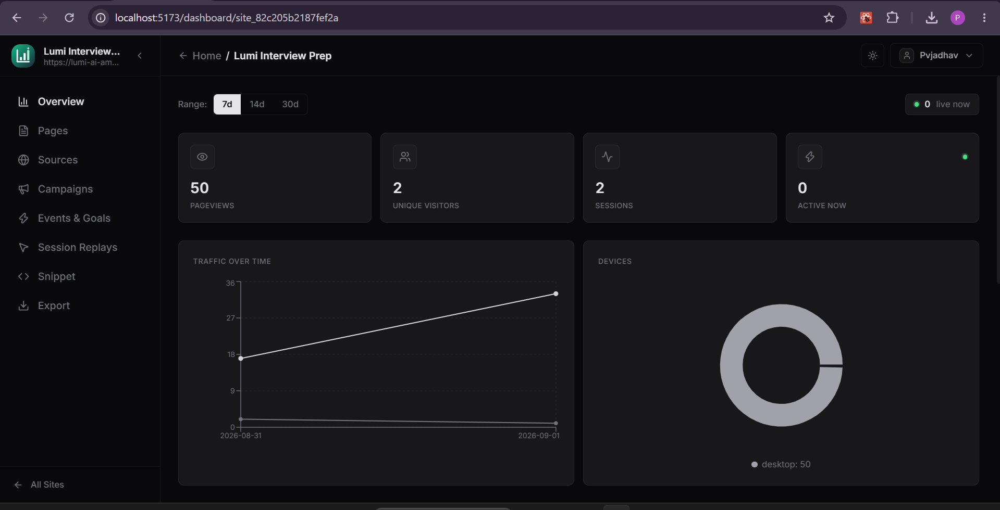

# Luminary 🚀

[](https://luminary-zeta-five.vercel.app)
[](https://luminary-scalable-web-event-engine.onrender.com)
[](https://fastapi.tiangolo.com/)
[](https://react.dev/)
[](https://www.typescriptlang.org/)
[](https://tailwindcss.com/)

> **High-Throughput Web Event Engine & Real-Time Analytics Platform**  
> Luminary is a production-grade, scalable event ingestion and telemetry analytics platform built for modern web applications. It features high-throughput API collection, custom goal tracking, session telemetry, and multi-tenant site management.

---

## 🖥️ Platform Preview

### Real-Time Interaction & Analytics
Experience seamless real-time analytics updates and site management.



### Analytics Dashboard
Comprehensive analytics dashboard showing live pageviews, unique visitors, active sessions, traffic time-series graphs, and device breakdowns.



---

## ✨ Core Features

| Feature | Description |
|---|---|
| ⚡ **High-Throughput Event Ingestion** | Asynchronous `/api/v1/collect` endpoint built with FastAPI for fast event buffering. |
| 📊 **Real-Time Analytics Dashboard** | Interactive React dashboard displaying live pageviews, unique visitors, active sessions, top pages, referrers, and geolocation breakdown. |
| 🎯 **Custom Event & Goal Tracking** | Capture custom user interactions, conversion milestones, and key business events effortlessly. |
| 🔄 **Session Telemetry & Replays** | Track visitor journeys, entry/exit pages, referral sources, user agents, and session duration distributions. |
| 🔐 **Multi-Tenant Authentication** | Secure account management with domain CORS protection. |
| 📜 **Embeddable Tracking Snippet** | Lightweight, asynchronous JavaScript tracking snippet for 1-minute site setup. |

---

## 💻 Tech Stack

### Backend
- **Framework:** [FastAPI](https://fastapi.tiangolo.com/) (Python)
- **Primary Database & ORM:** [SQLModel](https://sqlmodel.tiangolo.com/) / [SQLAlchemy](https://www.sqlalchemy.org/) (SQLite / PostgreSQL)
- **Authentication & Security:** JWT tokens, Passlib, CORS middleware

### Frontend
- **Framework:** [React 18](https://react.dev/) + [Vite](https://vitejs.dev/) + [TypeScript](https://www.typescriptlang.org/)
- **Styling:** [Tailwind CSS](https://tailwindcss.com/) + Dark/Light Theme System
- **Visualization:** [Recharts](https://recharts.org/)
- **Icons & UI:** Lucide React, Glassmorphic Design Tokens

---

## 🚀 Quick Start Guide (Local Development)

Follow these exact commands to run the application locally on Windows.

### 1. Backend Setup (Terminal 1)

Navigate to the backend directory, activate the virtual environment, and start the FastAPI server:

```powershell
cd backend
.\.venv\Scripts\Activate.ps1
pip install -r requirements.txt
uvicorn app.main:app --reload --port 8000
```

The FastAPI API documentation will be available at `http://localhost:8000/docs`.

### 2. Frontend Setup (Terminal 2)

Navigate to the frontend directory and start the Vite development server:

```powershell
cd frontend
npm install
npm run dev
```

The frontend application will be running at `http://localhost:3000`.

---

## ⚙️ Environment Configuration

Ensure you have a `.env` file in your `backend` directory (copy from `backend/.env.example` if not present).

| Variable | Required | Description |
|---|---|---|
| `DATABASE_URL` | Optional | PostgreSQL connection string. Falls back to SQLite if empty. |
| `SQLITE_PATH` | Yes | SQLite database file path (e.g. `app.db`) |
| `SECRET_KEY` | Yes | Secret key used for signing authentication JWT tokens |
| `CORS_ORIGINS` | Yes | Comma-separated allowed frontend origins |

---

## 📂 Directory Structure

```text
Luminary/
├── README.md                  # Project documentation & setup guide
├── docs/                      # Project guides and visual assets
├── backend/
│   ├── app/
│   │   ├── api/               # FastAPI route handlers
│   │   ├── core/              # Config, DB models, security
│   │   └── services/          # Business logic and integrations
│   └── requirements.txt       # Python dependencies
└── frontend/
    ├── src/
    │   ├── pages/             # React Router pages
    │   ├── components/        # Reusable UI components
    │   └── lib/               # API client library & utilities
    └── package.json           # Node dependencies
```

---

## 📄 License

This project is licensed under the [MIT License](LICENSE).
