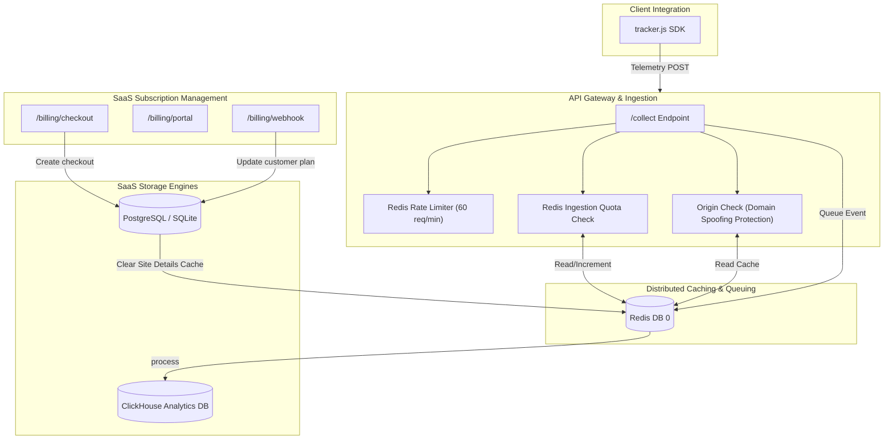

# Luminary Analytics: Production Hardening & SaaS Architecture Audit

This document reviews the production-grade capabilities implemented to transition the Luminary Analytics engine from a local proof-of-concept into a resilient, scalable, and monetized SaaS product.

---

## 1. Resolved Production Gaps & Architecture



---

## 2. Hardened Capabilities Review

### Phase 1: Security & Traffic Hardening
1. **Domain Spoofing Protection**:
   * **Mechanism**: Verifies incoming `Origin` and `Referer` headers against the registered hostnames in the SQL database.
   * **Outcome**: Blocked malicious script injections and fake data collection from unauthorized hostnames (returning `400 Bad Request`).
2. **Redis-based Rate Limiting**:
   * **Mechanism**: Slides an active window of requests per client IP in Redis.
   * **Parameters**:
     * Ingestion (`/collect`): Limit of `60 requests / minute` per IP.
     * Auth (`/register`, `/verify-otp`, `/resend-otp`): Maximum `5-10 attempts` per IP to prevent brute-force OTP attempts.

### Phase 2: Custom Events Instrumentation
1. **Analytics Extension**:
   * Exposes `window.luminary.track("event_name")` directly through the client tracker SDK script.
2. **ClickHouse Enrichment**:
   * Worker processes parse session identifiers, user agents, and geolocation to enrich custom events telemetry.
3. **Conversion Dashboard Card**:
   * Renders the conversion percentage rates alongside unique user trigger details.

### Phase 3: SaaS Monetization & Quota Gating
1. **Usage Quota Gating**:
   * Checks Redis monthly counters (`quota:{site_id}:{YYYY-MM}`) at the entry gate.
   * Rejects telemetry ingestion once a customer hits their subscription limit (returning `402 Payment Required`).
2. **Stripe Billing Integration**:
   * Exposes checkout endpoints, customer billing portals, and webhooks verifying Stripe signatures.
   * **Local Developer Onboarding**: Seamless mock modes built-in to immediately handle upgrade/portal actions if keys are omitted.

---

## 3. End-to-End Verification Outputs

### Ingestion Quota Enforcement Test (Limit = 5)
```text
Running quota enforcement test (limit = 5)...
Request 1 -> Status Code: 204 (Ingested)
Request 2 -> Status Code: 204 (Ingested)
Request 3 -> Status Code: 204 (Ingested)
Request 4 -> Status Code: 204 (Ingested)
Request 5 -> Status Code: 204 (Ingested)
Request 6 -> Status Code: 402 (Exceeded)
Response: {"detail":"Monthly event quota exceeded. Please upgrade your subscription plan."}
Request 7 -> Status Code: 402 (Exceeded)
Response: {"detail":"Monthly event quota exceeded. Please upgrade your subscription plan."}
```

### Dashboard Conversion Goals View
The aggregation pipeline correctly updates ClickHouse metrics and displays them in our dark-theme dashboard view:


